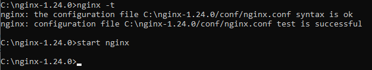
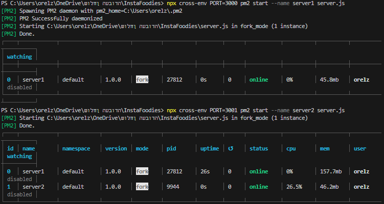
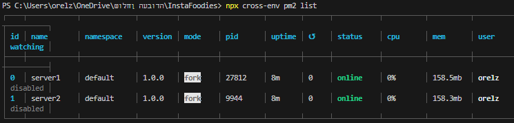

<div align="center">
  
  <h1>🔌 Backend Server Mastery: Empowering InstaFoodies' Heartbeat 💻</h1>
  <p>Embark on a journey into the robust backend server architecture of InstaFoodies, where culinary passion meets technological excellence!</p>
</div>

---
# 👨‍💻 Instafoodies Server 

Welcome to the Insta Foodies Server repository! This server-side component is an integral part of the Insta Foodies social app, offering food enthusiasts a unique and delightful experience. Powered by Node.js with load balancing and multi-threading capabilities, this server ensures high performance and efficient handling of user traffic. The server integrates seamlessly with the Insta Foodies mobile application, utilizing the Model-View-ViewModel (MVVM) architecture to maintain a well-structured codebase and deliver a smooth user interface.

## 📚 Table of Contents
- [System Architecture](#-system-architecture)
  - [Architectural Design](#-architectural-design)
  - [Decomposition Description](#-decomposition-description)
  - [Design Rationale](#-design-rationale)
- [Data Design](#-data-design)
  - [Data Description](#-data-description)
  - [Data Dictionary](#-data-dictionary)
- [Component Design](#-component-design)
  - [User Authentication and Registration](#-user-authentication-and-registration)
  - [Main Feed and Navigation](#-main-feed-and-navigation)
  - [User Profile and Settings](#-user-profile-and-settings)
  - [Sharing with Friends, Post Creation and Editing](#-sharing-with-friends-post-creation-and-editing)
  - [AI Models for Food & Spam Detection](#-ai-models-for-food--spam-detection)
  - [Notify User by Text](#-notify-user-by-text)
  - [Search Functionality](#-search-functionality)
  - [Payment Handler](#-payment-handler)
  - [Chat and Messaging (WhatsApp-like)](#-chat-and-messaging-whatsapp-like)
  - [Recipe Web Scraping and Integration](#-recipe-web-scraping-and-integration)
  - [Multi-Threaded Server and Load Balancing](#-multi-threaded-server-and-load-balancing)
- [Getting Started](#-getting-started)
  - [Prerequisites](#-prerequisites)
  - [Installation](#-installation)
  - [Configuration](#-configuration)
  - [Usage](#-usage)
- [License](#-license)

  
## 💻 System Architecture

Combination of different architectural patterns and concepts to achieve a specific application's goals. While it doesn't precisely fit into any single established pattern, it incorporates several principles to create a custom solution:


**Task Queue Architecture:**
- This pattern focuses on efficiently distributing tasks among available workers, allowing for parallel processing and scalability.


**Microservices-like Separation of Responsibilities:**
- Division of components similar to microservices - separation of concerns.


**Controller Pattern:**
- The controller, processes incoming requests, manages the flow of data, and delegates tasks.


**Server-Client Model:**
- Clients make requests to the server, which manages the task distribution and worker responses.


**Asynchronous Event-Driven Processing:**
- The architecture focus on queuing tasks and asynchronous processing is reminiscent of event-driven architectures. Events (tasks) are queued and processed independently when resources are available.


**Distributed Processing:**
- The delegation of tasks to worker components can be considered a form of distributed processing, distributing computation across multiple units to achieve efficiency.


### 👨‍💻 Architectural Design

The Insta Foodies Server follows the Model-View-ViewModel (MVVM) architectural pattern, promoting the separation of concerns and ease of codebase maintenance. This design consists of three core components:

- Model: Handles communication with the database and data-related logic.
- View: Interfaces with the Android UI, managing layouts and user interface elements.
- View Model: Prepares data from the Model for the UI and contains UI-related logic.

### 📦 Decomposition Description

The server is modularized into several distinct modules, each responsible for specific functionalities:

1. **User Authentication and Registration:** Manages user registration, authentication, and secure processes, including verification emails.
2. **Post Creation and Editing:** Handles post creation, editing, and management, enabling image uploads, descriptions, and structured recipe data.
3. **Feed Display and Navigation:** Displays user feeds with chronological posts and allows interactions such as likes, comments, and shares.
4. **User Profile and Settings:** Manages user profiles, settings, and customization.
5. **Search Functionality:** Implements user search queries, organizes search results, and provides auto-complete suggestions.
6. **Notifications:** Sends notifications for interactions related to user activities and preferences.
7. **Chat Messaging:** Enables real-time chat, individual and group messaging, multimedia sharing, and message history.
8. **Content Recognition and Reporting:** Utilizes AI for object detection to identify recognizable food content in posts, managing reporting and moderation.
9. **Recipe Web Scraping and Integration:** Fetches external recipes, integrates them into the app's database, and displays them seamlessly.
10. **Multi-Threaded Server and Load Balancing:** Manages the application's logic using a multi-threaded server architecture and load balancing through NGINX.

### 🎨 Design Rationale

The Model-View-ViewModel (MVVM) architectural pattern was selected for its ability to separate concerns and ensure a well-organized codebase. Decomposing the application into modules enhances code readability, maintainability, and scalability. Each module serves a specific purpose, fostering collaboration and allowing new features to be seamlessly integrated.

## 📊 Data Design

### 📋 Data Description

The server utilizes either Firebase or SQLite as the database to store various types of data relevant to the Insta Foodies app:

- User Information: Stores essential user details, such as usernames, emails, and online/offline status.
- User Account Information: Manages user-specific account data, including followers, followings, cart items, and business/regular distinctions.
- Post Information: Stores comprehensive post data, encompassing captions, ingredients, instructions, images, and timestamps.
- User Feed: Stores references to posts from followed users, contributing to the user's personalized feed.
- User Liked Posts: Tracks references to posts that a user has liked, enhancing the user's engagement with content.
- Reported Posts: Manages references to posts flagged by the content recognition module, facilitating content moderation.
- Utils: Provides a collection for maintaining data such as ingredient options, promoting consistency.

### 📕 Data Dictionary

The Insta Foodies Server utilizes the following tables or collections to store data:


1. User information - A table or collection that stores the relationship between users.
2. User Account information – A table or collection storing account information.
3. Post information - A table or collection that stores posts information.
4. User feed - A table or collection storing references to the user's followings posts.
5. User-liked posts - A table or collection storing references to posts he/she liked.
6. Reported posts – - A table or collection storing references to MLKIT reported posts.
7. Utils – A table or collection storing Ingredients options list.


## 🎛 Component Design

The Insta Foodies Server comprises several components, each responsible for specific functionalities:

### 🔒 User Authentication and Registration

**Component:** Login
**Responsibilities:** Manages user registration, login, and authentication.
**Subcomponents:** Login Activity, Layout Login Activity, Register Activity, Layout Register Activity.
**Functionalities:** Register, Login.

### 📰 Main Feed and Navigation

**Component:** Home
**Responsibilities:** Displays the main feed, posts, and comments, and provides user navigation.
**Subcomponents:** Home Activity, Layout Home Activity, Post Adapter, Navigation Menu.
**Functionalities:** Feed view, Post view, like a Post, comment on a post, add post to cart, share post, see more/see less, navigations to Home, Search user, Add Post, Notifications, Profile Page, Chat.

### 👤 User Profile and Settings

**Component:** Profile
**Responsibilities:** Manages user profiles, settings, customization, and related data.
**Subcomponents:** Profile Activity, Layout Profile Activity, Edit Profile, Layout Edit Profile.
**Functionalities:** App bar options, profile photo view, post details, user posts grid, cart grid, liked posts grid, navigations to Home, Search user, Add Post, Notifications, Profile Page.

### 📸 Sharing with Friends, Post Creation and Editing

**Component:** Share
**Responsibilities:** Supports post creation, editing, and sharing with followers.
**Subcomponents:** Share Activity, Image Adapter, Create Post Activity, Layout Share Activity, Layout Create Post Activity.
**Functionalities:** Create post with photos, description, recipe details, navigations to Home, Search user, Add Post, Notifications, Profile Page.

### 🤖 AI Models for Food & Spam Detection

**Component:** MLKIT
**Responsibilities:** Utilizes AI for food and spam detection, reports illegal post uploads.
**Subcomponents:** Object Detection, Spam Text Detection.
**Functionalities:** Runs AI model on post uploads for content recognition and moderation.

### 📣 Notify User by Text

**Component:** Notifications
**Responsibilities:** Sends notifications to users based on events and preferences.
**Subcomponents:** Reminder, Reminder Broadcast.
**Functionalities:** Sends notifications at specified intervals, reminding users of events.

### 🔍 Search Functionality

**Component:** Search
**Responsibilities:** Implements user search functionality and auto-completion.
**Subcomponents:** Search Activity, Layout Search Activity.
**Functionalities:** Auto-complete users search bar, navigations to Home, Search user, Add Post, Notifications, Profile Page.

### 💰 Payment Handler

**Component:** Payment
**Responsibilities:** Manages payments to business users for accessing special content.
**Subcomponents:** PayPal Activity.
**Functionalities:** Facilitates payment transactions to business users.

### 💬 Chat and Messaging (WhatsApp-like)

**Component:** Chat
**Responsibilities:** Enables real-time chat, messaging, and interactions between users.
**Subcomponents:** Chat Activity, Chat Profile Activity, Chat Find Friends Activity, Main Chat Activity, Messages Adapter, Request to Chat Activity.
**Functionalities:** Chat request, accept/reject requests, individual/group chat, multimedia sharing, message history, navigations to Home, Search user, Add Post, Notifications, Profile Page.

### 📚 Recipe Web Scraping and Integration

**Component:** Scraping
**Responsibilities:** Fetches and integrates external recipes into the app's database.
**Subcomponents:** Scraping file.
**Functionalities:** Retrieves recipes from external sources and integrates them seamlessly.

### 🚀 Multi-Threaded Server and Load Balancing

**Component:** Insta-foodies Server
**Responsibilities:** Manages multi-threaded server architecture and load balancing.
**Subcomponents:** Server, Workers Handler, Worker, Entry Controller.
**Functionalities:** Efficiently handles incoming requests, balances workloads, and ensures optimal performance.

## 🚀 Getting Started

You can follow this step-by-step guide or watch the video tutorial on [YouTube](https://www.youtube.com/watch?v=8Se_F7c03UM).

### ⚙ Prerequisites

- Install npm:
    ```sh
    npm install -g npm
    ```

- Install Node.js (version 18.5.0) on your computer:
    - Windows: [Download Node.js](https://nodejs.org/en/)
    - Ubuntu:
      ```sh
      sudo npm cache clean -f
      sudo npm install -g n
      sudo n latest
      ```

- Open a folder for the server.

### 🛠 Installation

1. Clone the project to the folder.

2. Navigate to the project folder in the terminal.

3. Initialize the project:
    ```sh
    npm init
    ```

4. Install dependencies:
    ```sh
    npm install express firebase-auth firebase firebase-admin firebase-tools nodemon morgan apicache
    ```

    - To keep the server running and automatically update with changes, add the following to your `package.json`:
      ```json
      "scripts": {
          "start": "nodemon server.js",
          ...
      }
      ```

5. Generate a new private key for Firebase:
   - Go to Project settings -> Service accounts.
   - Generate a new private key.
   - Open the `key.js` file and paste the generated key.

6. Install Nginx (web server similar to Apache):
    - Ubuntu: 
      ```sh
      sudo apt install nginx
      ```
    - Windows: Watch the [tutorial](https://www.youtube.com/watch?v=3-3o3Yz4GvY).
    - Full Nginx tutorial: [YouTube](https://www.youtube.com/watch?v=5PrT5uKszQo)

7. Using Nginx as a load balancer:
    - Watch the [tutorial](https://www.youtube.com/watch?v=2X4ZO5tO7Co&list=PLaiZP3KJsJOoFP4JwV_GlRfjmz-w54d1K&index=4)
    - General commands:
        - Check Nginx configuration: `nginx -t`
        - Start Nginx: `start nginx`
        - Reload Nginx: `nginx -s reload`

8. Install OpenSSL on Windows: [Tutorial](https://www.youtube.com/watch?v=cBa87N_BZ4s)

### ⚙ Configuration

- To run the server with Nodemon:
    ```sh
    npm start
    ```

- To run the server without Nodemon:
    ```sh
    node .\server.js
    ```

### ▶ Usage

### Running Without PM2

- For more details, watch this [video](https://www.youtube.com/watch?v=oykl1Ih9pMg&list=PLatLJHenaEliXO6AVHwu_5nejsebpNFfB&index=5)

1. Install PM2 (process manager):
    ```sh
    npm install -g pm2
    ```

2. Start the server with PM2:
    ```sh
    pm2 start server.js
    ```

3. Additional commands:
    ```sh
    pm2 status
    pm2 restart server.js
    pm2 stop server.js
    pm2 logs
    pm2 flush
    ```

4. To run multiple servers on different ports:
    - Install cross-env:
      ```sh
      npm install --save-dev cross-env
      ```
    - Start servers with different ports:
      ```sh
      npx cross-env PORT=3000 pm2 start --name server1 server.js
      ```

5. Save PM2 configuration:
    ```sh
    pm2 save
    ```

This script: `powershell -ExecutionPolicy Bypass` allows running scripts without permanently changing the system's execution policy.


### 📝 In Practice

```sh
nginx -t
start nginx
```
| Start Nginx Load Balancer |
| :---: |
|  |

```sh
npx cross-env PORT=3000 pm2 start --name server1 server.js
```
| Server Creation With Pm2 |
| :---: |
|  |

```sh
npx cross-env pm2 list
```
| Servers Are Running && Waiting For Tasks |
| :---: |
|  |


## Useful Sources

- [Building the Android Side (Client) Tutorial](https://www.youtube.com/watch?v=ycja50TzjoU)
- [Retrofit Documentation](https://square.github.io/retrofit/)
- [Organizing Files in Node.js](https://www.youtube.com/watch?v=T8SZv6h2WbY)
- [CRUD Methods Tutorial](https://www.youtube.com/playlist?list=PLrnPJCHvNZuCbuD3xpfKzQWOj3AXybSaM)
- [Retrofit Tutorials](https://futurestud.io/tutorials/retrofit-2-how-to-delete-objects-on-the-server)
- [HTTP Status Codes](https://en.wikipedia.org/wiki/List_of_HTTP_status_codes)
- [Guide on Running Multiple Servers with PM2](https://www.youtube.com/watch?v=14zY-u9EBCU)

Once the server is set up and running, it seamlessly integrates with the Insta Foodies mobile application. Users can enjoy the unique and delightful experience of connecting with fellow food enthusiasts, exploring recipes, sharing content, and engaging in real-time chat.

## 📄 License

This project is licensed under the MIT License. Feel free to use and modify the code as needed.

Thank you for choosing the Insta Foodies Server for your food enthusiasts' social app. We're excited to see the delightful experiences you create for food lovers around the world! If you have any questions or need further assistance, please don't hesitate to reach out to our support team. Happy coding! 🍕

